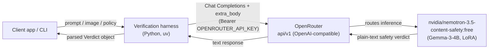
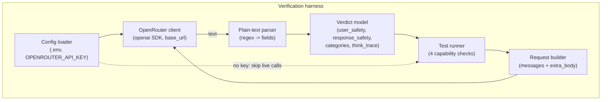
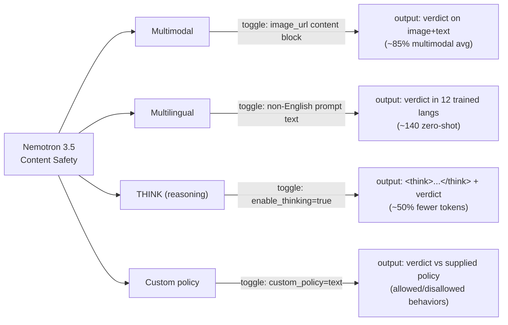
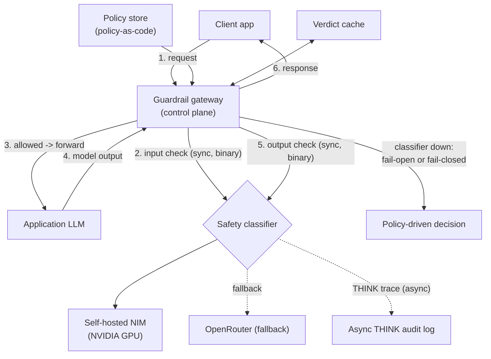
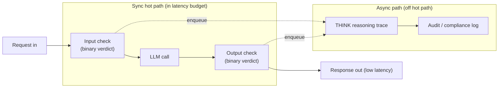
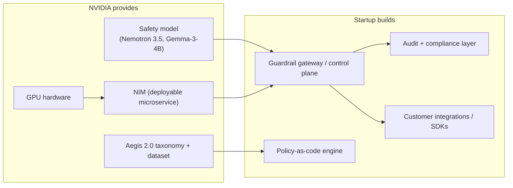

# Architecture Diagrams — Nemotron 3.5 Content Safety

Diagrams are grounded in `docs/00-PROJECT-BRIEF.md`. The verification harness calls
`nvidia/nemotron-3.5-content-safety:free` via OpenRouter (OpenAI-compatible Chat Completions).
The co-build product is a guardrail gateway operated by a security startup on top of NVIDIA's
model + NIM + GPU.

---

## 1. Context diagram

How the pieces talk to each other end to end. The harness owns the orchestration: it builds
OpenAI-compatible requests (with `extra_body.chat_template_kwargs` toggles), sends them over
HTTPS to OpenRouter, and OpenRouter routes inference to the Nemotron safety model. The model
returns **plain text** (not JSON), which the harness parses into a structured verdict before
handing it back to the client app.



---

## 2. Component diagram — the harness

Internal structure of the verification harness. The **config loader** reads `OPENROUTER_API_KEY`
(degrading gracefully when absent), the **request builder** assembles messages + `extra_body`,
the **OR client** wraps the `openai` SDK pointed at the OpenRouter base URL, the **plain-text
parser** converts the response into a **verdict model**, and the **test runner** drives the four
capability checks. The parser is the load-bearing component because the model emits text, not JSON.



---

## 3. Sequence diagram — one moderation call WITH THINK mode

A single moderation call with reasoning enabled. The builder sets
`chat_template_kwargs.enable_thinking = true` (plus `request_categories`), the model returns a
`<think>...</think>` block followed by the verdict lines, and the parser splits the reasoning
trace from the structured fields. Key insight: THINK adds a reasoning preamble to the **same**
plain-text response — there is no separate channel, so parsing must strip the `<think>` block.

```mermaid
sequenceDiagram
    participant C as Client
    participant B as Request builder
    participant OR as OpenRouter
    participant M as Nemotron model
    participant P as Parser

    C->>B: moderate(prompt, think=true, categories=true)
    B->>OR: POST /chat/completions<br/>messages + extra_body.chat_template_kwargs<br/>{enable_thinking:true, request_categories:"/categories"}
    OR->>M: routed inference
    M-->>OR: "&lt;think&gt;...reasoning...&lt;/think&gt;<br/>User Safety: unsafe<br/>Response Safety: unsafe<br/>Safety Categories: Controlled Substances"
    OR-->>P: plain-text response
    P->>P: split think trace from verdict lines
    P-->>C: Verdict{user_safety:unsafe,<br/>categories:[...], think_trace:"..."}
```

---

## 4. The four-capabilities map

The four headline claims the harness verifies, each with the toggle that activates it and the
observable output that confirms it. Multimodal and multilingual are driven by **input shape**
(content blocks / language of text), while THINK and custom-policy are driven by **`extra_body`
toggles**. Each row is independently testable.



---

## 5. Productionized guardrail gateway (co-build product)

The product a security startup operates. Every client call passes through the gateway twice:
an **input check** before the LLM and an **output check** after. The gateway reads a **policy
store** (policy-as-code), uses a **cache** to skip repeat checks, and applies a **fail-open vs
fail-closed** decision when the classifier is unavailable. THINK runs **asynchronously** into an
audit log so reasoning never blocks the response. Inference can hit a **self-hosted NIM on NVIDIA
GPU** or fall back to **OpenRouter**.



---

## 6. Latency-budget diagram

Why a 4B reasoning-capable safety model changes the tradeoff. The **sync hot path** returns a
**binary verdict** with low latency (default mode ~3x lower latency than other multimodal safety
models). The **async path** fires the **THINK reasoning trace** off the critical path into the
audit log, so explainability is captured without adding latency to the user-visible request.



---

## 7. Co-build value split

Who builds what. NVIDIA supplies the foundational ML assets — model, NIM packaging, GPU
hardware, and the Aegis 2.0 taxonomy/dataset. The startup builds the operational product around
it — the gateway, policy-as-code, audit/compliance tooling, and customer integrations. The split
lets each side do what it does best: NVIDIA owns the model and silicon, the startup owns the
control plane and the customer relationship.


